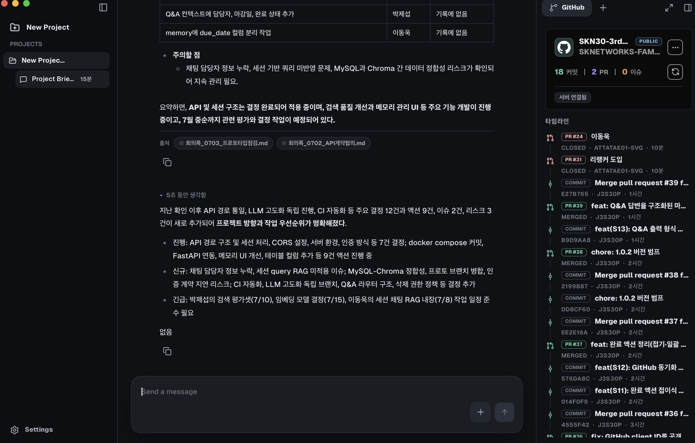
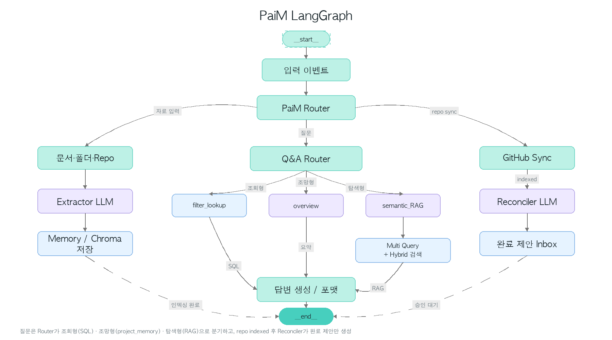
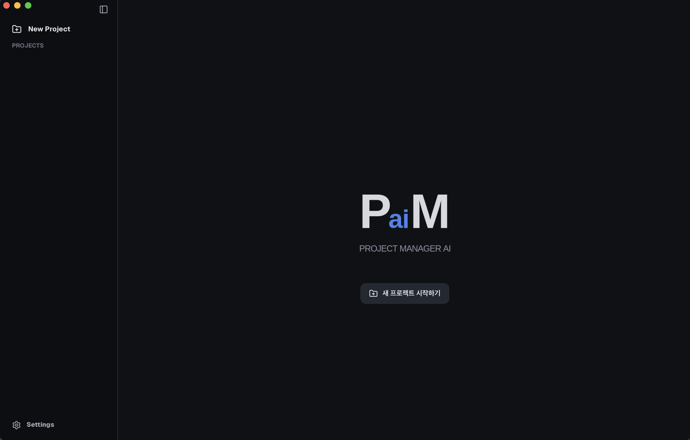
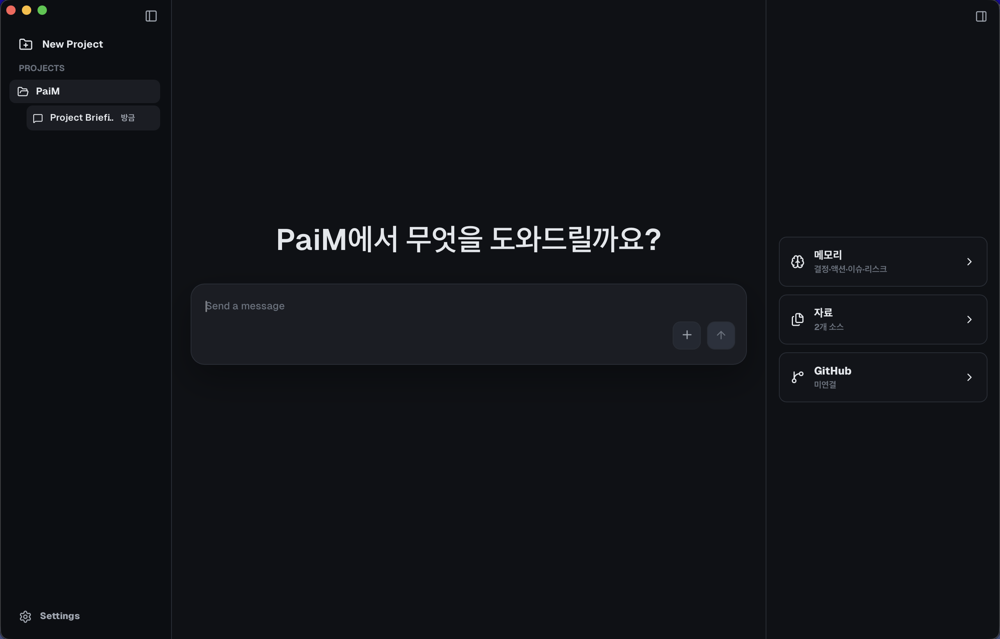
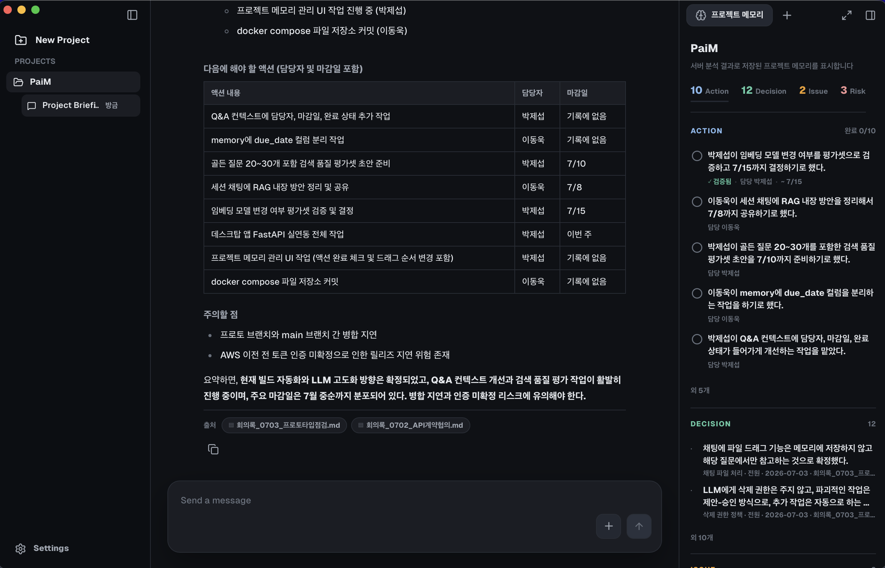
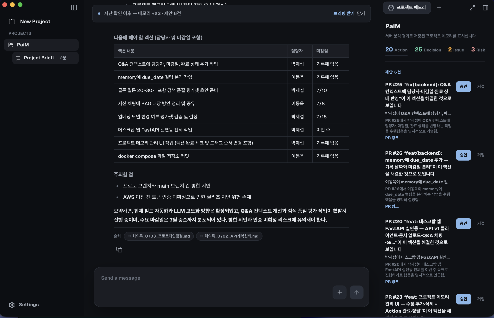

# PaiM — Project AI Manager

> **내가 쉬는 동안 프로젝트를 파악해주는 AI PM.**
> 회의록·문서·GitHub 활동을 하나의 **살아있는 메모리**로 쌓고, AI가 스스로 Issue와 PR을 읽어 액션 완료를 감지하고 다음 할 일을 제안합니다.

**Download:** https://github.com/SKNETWORKS-FAMILY-AICAMP/SKN30-3rd-1Team/releases


회의록과 git 저장소를 하나의 **살아있는 프로젝트 기억**으로 통합하는 LLM 기반 AI 프로젝트 매니저입니다.

단순히 문서를 요약해주는 것보다, **회의록에서 나온 할 일이 PR 머지로 자동 정리되는 순환** — 즉 계획(문서)과 실행(git)이 분리되지 않는 관리 경험에 초점을 맞췄습니다.



## Quick Summary

- 회의록(.md/.txt/.pdf) 업로드 → LLM이 **결정·액션·이슈·리스크**로 구조화 추출
- GitHub repo 연결 → 머지된 PR이 열린 액션을 해결하면 **완료 제안** (승인은 항상 사람)
- 질문 의도별 3경로 Q&A — 조회형은 **DB 직조회로 정답 보장**, 탐색형은 하이브리드 RAG
- 앱을 열면 "지난 확인 이후" 변화를 **델타 브리핑**으로
- macOS·Windows 데스크탑 앱, 태그 push 시 CI 자동 릴리즈

```text
문서 업로드 ─┐
             ├→ LLM 구조화 추출 → 프로젝트 메모리 (MySQL + ChromaDB + 응축 요약)
repo 연결  ─┘
repo sync → 머지 PR × 열린 액션 대조(Reconciler) → 완료 제안 → 사용자 승인
질문 → 의도 라우터 → 조회(SQL 직조회) / 조망(요약) / 탐색(멀티쿼리 RAG) → 출처 있는 답변
```

## Architecture



질문은 Router가 조회형(SQL) · 조망형(project_memory) · 탐색형(RAG)으로 분기하고, repo가 indexed 되면 Reconciler가 완료 제안만 생성합니다.

## Team

<table>
  <tr>
    <td align="center" width="180"><a href="https://github.com/hellohaeyeon"><br/><b>서해연</b></a><br/><sub>팀장 (PM)</sub><br/><sub>초기 스켈레톤 프로젝트 구축<br/>SQL 데이터베이스 세팅<br/>백엔드 API 구현(FastAPI)</sub></td>
    <td align="center" width="180"><a href="https://github.com/j3s30p"><br/><b>박제섭</b></a><br/><sub>팀원</sub><br/><sub>PaiM 데스크탑 앱 개발 및 릴리즈<br/>LangGraph 및 API 고도화<br/>기술지원</sub></td>
    <td align="center" width="180"><a href="https://github.com/star9906"><br/><b>김동휘</b></a><br/><sub>팀원</sub><br/><sub>백엔드 다중 세션 대화, 대화 암호화 구현<br/>업로드 저장 정합성 개선<br/>LangGraph 개선</sub></td>
    <td align="center" width="180"><a href="https://github.com/attatae01-svg"><br/><b>이동욱</b></a><br/><sub>팀원</sub><br/><sub>초기 LangChain 및 LangGraph 구현 및 테스트<br/>LangChain to LangGraph migration<br/>RAG 성능 평가 및 개선 진행</sub></td>
    <td align="center" width="180"><a href="https://github.com/robinlee3803-ai"><br/><b>이승민</b></a><br/><sub>팀원</sub><br/><sub>팀원 RAG 성능 검증 데이터 수집<br/>성능 평가를 위한 합성 데이터 생성</sub></td>
  </tr>
</table>

## Project Goal

이 프로젝트의 핵심 질문은 다음과 같습니다.

- 회의록 같은 비정형 기록에서 관리 가능한 구조(결정/액션/이슈/리스크)를 안정적으로 추출할 수 있는가?
- 기록 도구가 **실행(git)을 알 수 있는가** — PR 머지가 할 일 완료로 이어지는 순환을 만들 수 있는가?
- AI에게 어디까지 권한을 줄 것인가 — 파괴적 변경은 제안-승인, 추가는 자동이라는 비대칭 원칙
- "담당자·개수·마감" 같은 질문에 추측이 아닌 **정답을 보장**할 수 있는가?
- README·커밋·이슈 같은 소스의 성격을 구분해 읽을 수 있는가? (설치 안내문 ≠ 할 일)

## Repository Structure

```text
.
├── .github/workflows/
│   └── release.yml                  # 태그 push 시 macOS/Windows 설치본 자동 빌드
├── backend/
│   ├── api/                         # projects · documents · repositories · memory
│   │                                #   suggestions · delta · query 엔드포인트
│   ├── pipeline/                    # 추출(extractor, 소스 타입별 지침) + 저장(ingestor)
│   ├── reconciler/                  # PR→액션 완료 제안 (LangGraph, 배치 판정)
│   ├── retriever/                   # 의도 라우터 · Q&A 엔진(하이브리드 RRF) · 메모리 벡터
│   ├── chat/                        # AES-256-GCM 암호화 세션
│   ├── llm/                         # LLM 클라이언트 (fast/quality 티어링 팩토리)
│   ├── github/                      # GitHub App 연동 (설치 세션 · repo preview)
│   └── db/                          # MySQL(schema + migrate_v1~5) · ChromaDB
├── desktop/
│   ├── src/                         # React 19 UI (채팅 · 메모리 패널 · 제안 인박스 · 설정)
│   ├── src-tauri/                   # Tauri 2 런타임
│   └── .env.production              # 공개 빌드 설정 (OAuth client ID)
├── docs/                            # API 명세 · 검색 품질 평가셋
├── docker-compose.yml               # MySQL (스키마 자동 적용)
├── start-paim.bat                   # Windows 원클릭 실행 (Docker·백엔드·앱 자동 기동)
└── pyproject.toml
```

## Quick Start

### 사용자 — 릴리즈 설치

1. [Releases](https://github.com/SKNETWORKS-FAMILY-AICAMP/SKN30-3rd-1Team/releases)에서 설치 파일 다운로드 — macOS `.dmg`, Windows `-setup.exe` / `.msi`
2. macOS에서 "확인되지 않은 개발자" 경고 시: 시스템 설정 → 개인정보 보호 및 보안 → **그래도 열기** (코드 서명은 4차 로드맵)
3. 로컬 백엔드 준비(아래) 후 앱 실행 — 설정에서 서버 주소 변경 가능



### 백엔드 (필수 — 앱의 두뇌)

```bash
cp .env.example .env      # OPENAI_API_KEY · DB 비밀번호 · SESSION_MEMORY_KEY(base64 32바이트) 입력
docker compose up -d      # MySQL — 스키마 자동 적용
uv sync
uv run uvicorn backend.main:app --port 8000
```

### Windows 원클릭 실행 (`start-paim.bat`)

uv와 Docker Desktop이 설치되어 있다면 저장소 클론 후 루트의 `start-paim.bat`을 더블클릭하는 것으로 위 백엔드 과정 전체가 자동 진행됩니다.

1. Docker 데몬 확인 — 꺼져 있으면 Docker Desktop 자동 실행
2. `.env` 자동 생성 — 최초 1회만 메모장이 열리며 API 키와 `DB_PASSWORD` 입력 필요 (`SESSION_MEMORY_KEY`는 자동 생성)
3. MySQL 컨테이너 시작 후 준비될 때까지 대기
4. `uv sync` 후 백엔드를 새 창("PaiM Backend")에서 실행
5. 설치된 PaiM 앱 자동 실행

앱을 쓰는 동안 "PaiM Backend" 창은 켜둡니다. 두 번째 실행부터는 입력 없이 끝까지 자동 진행됩니다.

### 개발자 — 데스크탑 앱

요구사항: Node.js LTS, Rust/Cargo (Windows: MSVC Build Tools·WebView2 / macOS: Xcode CLT)

```bash
npm ci --prefix desktop
npm run demo --prefix desktop        # 개발 실행
npm run app:build --prefix desktop   # 설치본 빌드 (CI가 태그 push 시 자동 수행)
```

## How It Works

대부분의 프로젝트 관리 도구는 사람이 상태를 직접 갱신해야 하는 **죽은 기록**입니다. PaiM의 메모리는 프로젝트가 움직이면 따라 움직입니다.

```text
        ① 기록                    ② 관찰                       ③ 대조 (Reconciler)
  회의록·문서 업로드      GitHub 저장소 동기화           머지된 PR ↔ 열린 액션을
  → 결정·액션·이슈·      → README·커밋·열린            LLM이 매칭 → "이 액션,
    리스크 자동 추출        Issue·PR을 메모리에 적재       이 PR로 완료된 것 같아요"
        │                        │                            │
        └────────────┬───────────┘                            │
                     ▼                                        ▼
        ④ 브리핑 (Delta Briefing)                    ⑤ 제안 (Suggestion)
  앱을 다시 열면 "지난 확인 이후                 근거(PR 링크·이유)와 함께 제안,
  진행된 것 / 새로 생긴 것 / 급한 것"을          사람이 승인/거절로 확정
  스탠드업 브리핑으로 요약                        (승인 시 액션 완료 처리)
```

핵심은 **루프가 스스로 닫힌다**는 것입니다: 회의에서 "A가 X를 하기로 함"이 액션으로 기록되고 → A가 PR을 머지하면 → PaiM이 그 PR을 읽고 액션 완료를 제안하고 → 다음 브리핑에서 "X 진행됨"으로 보고됩니다. 사람은 상태를 갱신하는 대신 **제안을 승인만** 하면 됩니다.

### 1. 기억 만들기 — 소스를 아는 추출

프로젝트를 만들고 회의록을 올리면, LLM이 결정·액션·이슈·리스크로 구조화합니다. 소스 타입별로 다른 추출 지침을 사용합니다.

| 소스 | 추출 규칙 |
| --- | --- |
| 회의록/문서 | 결정·액션(담당자)·이슈·리스크 — 명확하지 않으면 추출 금지 |
| repo README | 설치·사용법 지시문은 액션 금지, 로드맵/TODO의 미완 항목만 액션 |
| repo 커밋 | 이미 끝난 일 — 액션이면 완료 상태로, 결정(마이그레이션 등) 중심 |
| 열린 이슈/PR | 현재 문제와 진행 중 작업 |





### 2. 기억이 스스로 갱신 — Reconciler

repo sync 시 머지된 PR과 열린 액션을 LLM이 배치 대조해, 해결로 보이는 것만 **근거(PR 링크·이유)와 함께 제안**합니다. LLM에게 삭제 권한은 없습니다 — 승인/거절은 항상 사람이 합니다. 사용자가 수정한 기록은 `is_user_verified`로 보호되어 LLM 재처리가 덮어쓰지 않습니다.



### 3. 기억에 묻기 — 의도 라우터

| 경로 | 대상 질문 | 방식 |
| --- | --- | --- |
| 조회형 | "박제섭 담당 미완료 액션은?" | 필터 추출 → SQL 직조회 → 결정론 템플릿 (**정답 보장**) |
| 조망형 | "전체 상황 정리해줘" | 응축 요약 직접 컨텍스트 (검색 없음) |
| 탐색형 | "왜 이 방식을 선택했어?" | 멀티쿼리 재표현 → BM25+벡터 RRF 융합 → 출처 있는 생성 |

채팅에 파일을 드래그하면 그 질문에서만 참고하는 임시 컨텍스트가 되며, 프로젝트 기억에는 남지 않습니다.

### 4. 자리 비운 사이 — 델타 브리핑

프로젝트를 다시 열면 지난 확인 시점 이후의 변화만 골라 "무엇이 진행됐고, 무엇이 새로 생겼고, 무엇이 급한가"를 스탠드업 대체 브리핑으로 요약합니다. 완료된 액션과 새 완료 제안 → 새 결정·액션·이슈·리스크 → 마감 임박·기한 초과 순서로, 자리를 비운 사이의 공백이 8문장 안에 메워집니다.

## Design Principles

- **정확도 > 재현율** — Reconciler의 완료 매칭은 "애매하면 보고하지 않는다"가 규칙입니다(high/medium 확신 + 한 줄 근거 필수). 놓친 제안은 다음 동기화나 사람이 잡을 수 있지만, 틀린 완료 처리는 신뢰를 무너뜨리기 때문입니다.
- **파괴적 변경은 제안-승인, 추가는 자동** — 메모리에 쌓는 것은 자동이지만 완료 처리처럼 상태를 바꾸는 일은 반드시 사람의 승인을 거칩니다. 메모리가 조용히 오염되지 않는 human-in-the-loop 구조입니다.
- **자기검증하는 답변 그래프** — 탐색형 Q&A는 LangGraph로 검색 → 답변 → 검증 → (부족하면) 질의 확장 후 재검색 → 다음 할 일(plan) 제안까지 도는 그래프입니다. plan 생성이 실패해도 답변은 유지되는 best-effort 설계입니다.
- **로컬 우선 + 암호화** — 백엔드는 `127.0.0.1`에만 바인딩되어 LAN에 노출되지 않고, 세션 대화는 AES-256-GCM으로 암호화 저장됩니다. 회의록이라는 민감 데이터를 다루는 도구로서의 기본기입니다.

## Data Model

| 카테고리 | 설명 |
| --- | --- |
| `decision` | 결정 사항 (기록된 이유 포함) |
| `action` | 할 일 — `owner`(담당) · `due_date`(마감) · `completed_at`(완료) · `sort_order`(정렬) |
| `issue` | 현재 문제 |
| `risk` | 잠재 위험 |

- `date` = 회의/문서의 기록 날짜, `due_date` = 마감일 (별개 컬럼)
- 완료 제안(`memory_suggestions`)은 근거·승인 이력과 함께 보존됩니다

## LLM Provider Support

| 제공자 | 구조화 추출 | Q&A |
| --- | :---: | :---: |
| OpenAI | ✅ | ✅ |
| Claude | ✅ | ✅ |
| Google | ❌ (중첩 스키마 미지원) | ✅ |
| Local (Ollama·vLLM 등) | ✅ | ✅ |

## Key Results

프로토타입 전 기능을 실서버 E2E + 시연 리허설로 검증했습니다.

| 항목 | 결과 |
| --- | --- |
| 회의록 액션 추출 (헤더 없는 서술형) | 9/9건, 담당자 100% 정확 |
| repo README 오추출 (소스 지침 적용 후) | 액션 4건 → **0건** |
| PR→액션 완료 제안 | 6/6건 매칭 (전부 high confidence) |
| 조회형 질문 정확도 | DB 직조회 — 담당·개수·마감 정답 보장 |
| 동일 질문 전/후 대비 | 승인 전 "진행 중" → 승인 후 "완료 (PR 근거)" |

## Roadmap

### 3차 프로젝트 마무리 (현재 — 로컬 서버, 개인 사용)

- [ ] 검색 품질 평가셋(골든 질문 20~30개) 구축 및 baseline 측정
- [ ] 세션 기반 채팅에 RAG 내장 — 서버 측 대화 이력 축적
- [ ] 임베딩 모델·리랭커 개선 — 평가셋 측정 결과 기반으로 결정

### 4차 프로젝트 (약 한 달 뒤 — 팀 서비스로 확장)

- [ ] AWS 서버 전환 — 로컬 전용에서 벗어나 상시 접속 가능한 서버로 (HTTPS, 서버 주소 계약)
- [ ] 로그인 시스템 — 사용자 계정과 토큰 인증 (현재 DEV 임시 인증 대체)
- [ ] 팀 협업 — 하나의 프로젝트를 팀원들이 공유 (멤버·권한 관리, 함께 쓰는 프로젝트 메모리)
- [ ] 입력 파일 확장 — 음성(회의 녹음), 이미지(화이트보드·스크린샷) 등도 분석 대상으로
- [ ] 메모리 생명주기 완성 — 이슈 해결 감지, 결정 계보(supersede), 중복 병합
- [ ] 코드 서명·공증 — 설치 경고 제거
